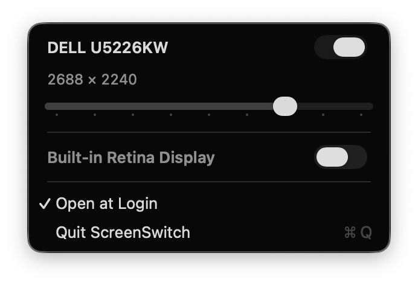

# ScreenSwitch

Turn a display off without unplugging it, and give it a scaled resolution that macOS does not offer. From the menu bar.

[](https://github.com/rvr31/screenswitch/releases/latest)


<p align="center">
  
</p>

macOS has no switch for a connected display. You unplug it or close the lid. And System Settings only offers a few "looks like" sizes per display, none of them between the two you want. ScreenSwitch puts both in a menu. No Dock icon, no window.

## What it does

- **Switch a display off and on.** The display stays connected and keeps its place in the arrangement. A display that is off stays in the menu, also after a restart, so you can switch it back on.
- **Pick any scaled size.** Each display gets a slider from the largest text to the most space, in eight HiDPI steps between half the panel width and the full panel width. Native is one of the stops. Drag to see the size, release to apply.
- **Open at Login.** One menu item registers ScreenSwitch as a login item.

## Install

1. Download `ScreenSwitch-<version>.zip` from the [latest release](https://github.com/rvr31/screenswitch/releases/latest).
2. Unzip it and move `ScreenSwitch.app` to `/Applications`.
3. Open `ScreenSwitch.app`.

Releases are signed with a Developer ID and notarized by Apple. The app runs on macOS 14 or later, on Apple silicon and Intel.

Choose "Open at Login" from the copy in `/Applications`. The login item points at the app the menu runs from.

### Updates

Download a newer version from the [latest release](https://github.com/rvr31/screenswitch/releases/latest). Quit ScreenSwitch, replace the copy in `/Applications`, and open it again. The app does not include an automatic updater.

## Command line

Each release also ships `screenswitch-cli`, which drives the same code without the menu bar. Commands run in order in one process:

```sh
screenswitch-cli status                  # displays, their modes and scaling state
screenswitch-cli off 4 wait 3 on 4       # switch display 4 off, wait, switch it on
screenswitch-cli scale 4 2304x1440       # scaled size, held until the process exits
screenswitch-cli sizes 4                 # the sizes the slider offers for display 4
```

Run `screenswitch-cli` without arguments for the full list. `status` only reads, the others change your displays.

## How it works

ScreenSwitch uses two private macOS APIs. Either can change or disappear in a macOS update.

- `CGSConfigureDisplayEnabled` from the SkyLight framework switches a display off and on. ScreenSwitch loads it at run time, so a missing symbol shows an error instead of a crash. A display that is off stays off after ScreenSwitch quits. ScreenSwitch remembers it and shows the switch again at the next launch.
- `CGVirtualDisplay` from CoreGraphics creates a virtual HiDPI display. For a scaled size, ScreenSwitch mirrors the panel onto a virtual display of that size. The GPU renders a 2x framebuffer and scales it onto the panel, which keeps its native signal. Each panel gets one virtual display that ScreenSwitch reuses for the next size.

Quit unmirrors every scaled display. The virtual displays end with the process, so a crash also returns the panels to their own mode.

## Build from source

You need macOS 14 or later and the Xcode command line tools.

```sh
./build-app.sh
```

This runs `swift build -c release` and writes `build/ScreenSwitch.app`, signed ad hoc. Install it with:

```sh
ditto build/ScreenSwitch.app /Applications/ScreenSwitch.app
```

`./test.sh` runs the unit tests. It adds the swift-testing paths that the command line tools leave out.

`scripts/verify-displays.sh` exercises every operation on your real displays: off, on, scale, native. Screens go dark and flicker for about 30 seconds, so save your work first. Pass the display IDs from `screenswitch-cli status` as arguments; they default to 4 (external) and 1 (built-in).

A local build reports version 1.0. Set `VERSION` when building to use a different bundle version, for example `VERSION=0.1.4 ./build-app.sh`.

## Releases

Every push to `main` that changes `Sources/`, `Package.swift`, `build-app.sh` or `LICENSE` runs the Release workflow. Changes to docs, tests or the workflow alone do not release; start a run by hand from the Actions tab when you need one. It runs the tests, builds universal binaries and publishes a GitHub release with the app zip, the CLI tarball, the matching source archive and `SHA256SUMS`. The version is the previous release with the patch number raised by one. For a minor or major bump, create a release such as `v0.2.0` by hand; the next push continues from there. Releases require the signing and notarization secrets in the protected `release` environment. See [docs/signing.md](docs/signing.md).

## License

Copyright (C) 2026 Robin van Raan.

ScreenSwitch is free software: you can redistribute it and/or modify it under the GNU General Public License, version 3 only (`GPL-3.0-only`). It is distributed without any warranty, including the implied warranties of merchantability or fitness for a particular purpose. See [LICENSE](LICENSE) for the full terms.

From v0.1.6, releases include their corresponding source code and build scripts in the source archive. The app bundle and CLI archive include the license and this README.
